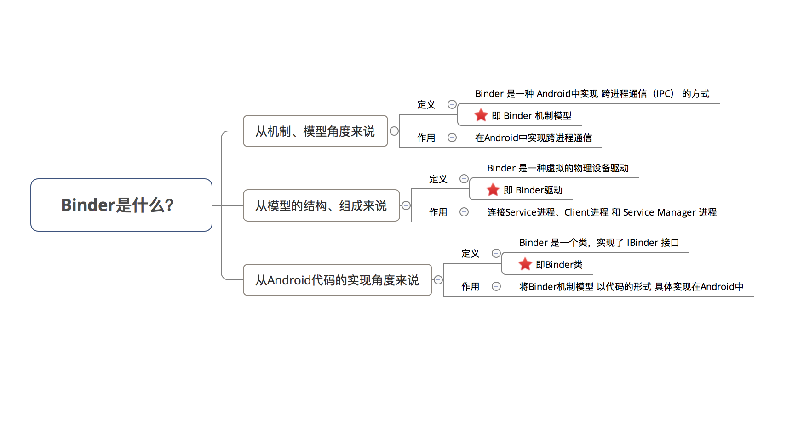
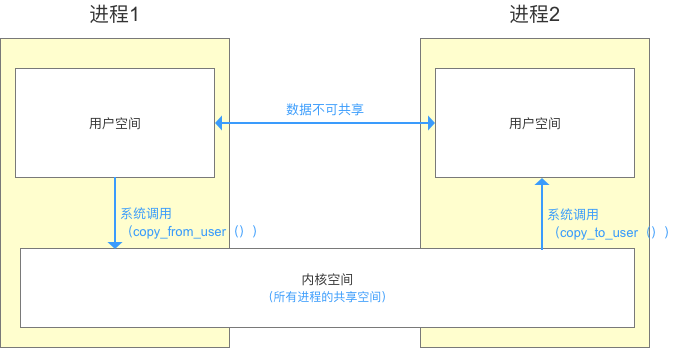
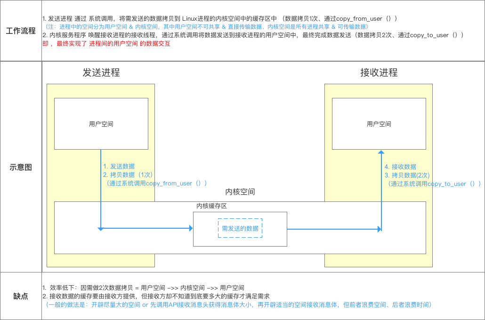
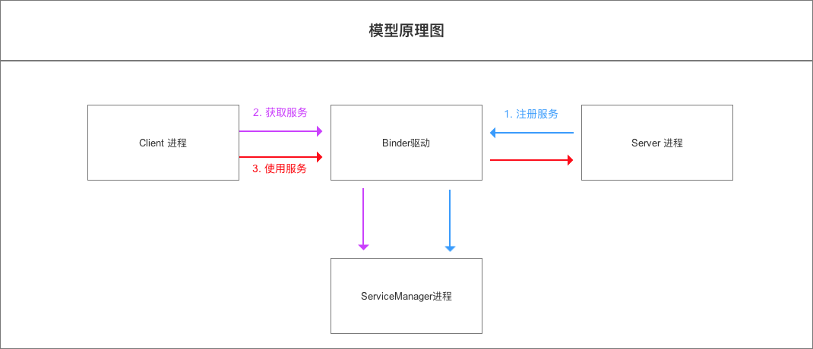
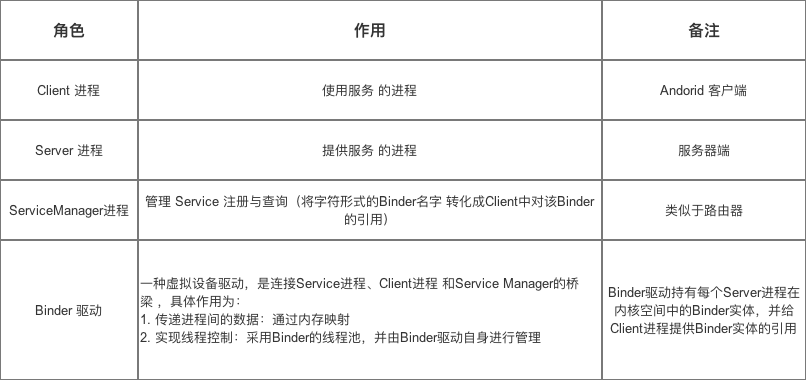
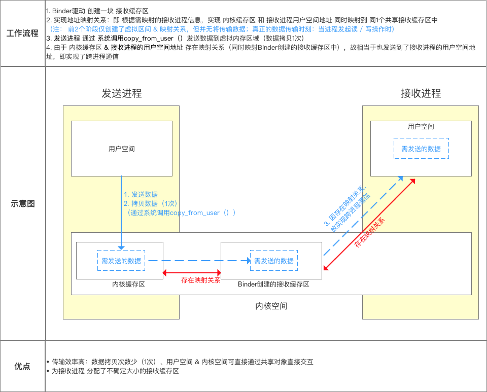
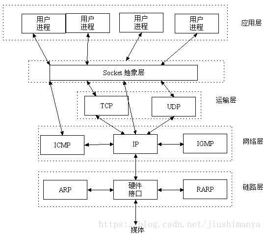
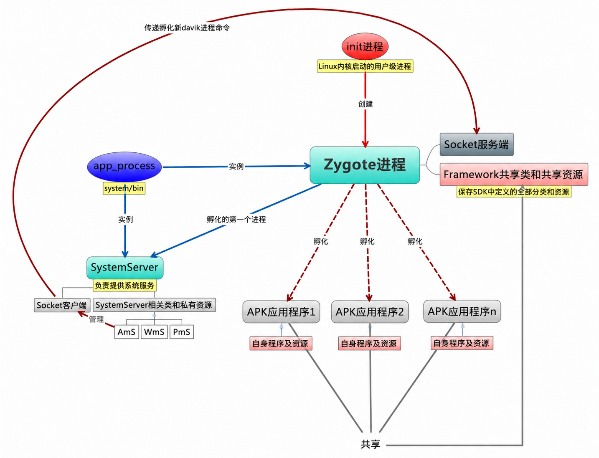

Android1

# 基础知识

## ART/Dalvik

安卓 APP 的运行环境可以理解为 Java/Kotlin 代码解释器和管理器。

Android App 大部分代码不是直接运行 CPU 机器码，而是：

```text
Java/Kotlin
   ↓
编译成 bytecode（字节码）
   ↓
交给虚拟机执行
```

使用 Java/Kotlin 开发 Android App，在编译打包生成 APK 文件时，会有这样一个流程：

1. Java 编译器将 Java 文件编译为 class 文件。
2. dx 工具将编译输出的类文件转换为 dex 文件，因为 Android 虚拟机不支持直接运行 class 文件。

Android 虚拟机主要经历过两类运行时：Dalvik 和 ART。JIT 与 AOT 是虚拟机为了提高运行效率采用的不同编译策略。

+ 老安卓：Dalvik VM
+ 新安卓：ART Runtime

### AOT (Ahead Of Time) 与 JIT

Dalvik 负责将 dex 翻译为机器码交由系统调用。这样有一个缺陷：每次执行代码，都需要 Dalvik 将操作码翻译为机器对应的微处理器指令，然后交给底层系统处理，运行效率很低。

为了提升效率，Android 在 2.2 版本中添加了 JIT 编译器。当 App 运行时，每当遇到一个新类，JIT 编译器就会对这个类进行即时编译。经过编译后的代码会被优化成相当精简的原生型指令码，也就是 native code。这样在下次执行到相同逻辑的时候，速度就会更快。

JIT 编译器可以对执行次数频繁的 dex/odex 代码进行编译与优化，将 dex/odex 中的 Dalvik Code（Smali 指令集）翻译成 Native Code 去执行。JIT 的引入提升了 Dalvik 的性能。

JIT 是运行时编译，是动态编译，可以对执行次数频繁的 dex 代码进行编译和优化，减少以后使用时的翻译时间。虽然它可以加快 Dalvik 运行速度，但将 dex 翻译为本地机器码本身也要占用时间。

AOT 是静态编译。应用在安装的时候会启动 `dex2oat` 过程，把 dex 预编译成 ELF 文件，每次运行程序的时候不用重新编译。

# Binder



## Linux 的基础知识



进程隔离是为了保证安全性和独立性。一个进程不能直接操作或者访问另一个进程，也就是说 Android 的进程是相互独立、隔离的。

跨进程通信（IPC）指进程间需要进行数据交互和通信。

跨进程通信的基本原理：



Binder 的作用是连接两个进程。它实现了 `mmap()` 系统调用，主要负责创建数据接收的缓存空间，并管理数据接收缓存。

Binder 跨进程通信机制模型基于 Client - Server 模式：







+ 存在映射关系：两个不同进程中的虚拟地址，实际上指向同一块物理内存。共享同一块物理页可以减少拷贝。

# Socket

TCP/IP（Transmission Control Protocol/Internet Protocol）即传输控制协议/网间协议，是一个工业标准的协议集，它是为广域网（WANs）设计的。TCP socket 是流式套接字。

UDP（User Data Protocol，用户数据报协议）是与 TCP 相对应的协议。它属于 TCP/IP 协议族。UDP socket 是数据报套接字。

Socket 其实就是一个门面模式。Socket 不是协议本身，而是操作系统提供给应用程序的一套网络通信接口。它把 TCP/IP 协议族的复杂细节封装起来，让程序员用类似“读文件、写文件”的方式进行网络通信。



服务端流程：

1. 创建 socket。

   ```c
   int sockfd = socket(AF_INET, SOCK_STREAM, 0);
   ```

2. 绑定本地 IP 和端口。

   ```c
   bind(sockfd, ...);
   ```

3. 监听连接。

   ```c
   listen(sockfd, 128);
   ```

4. 等待并接受连接。

   ```c
   int connfd = accept(sockfd, ...);
   ```

5. 收发数据。

   ```c
   read(connfd, buf, ...);
   write(connfd, buf, ...);
   ```

6. 关闭连接。

   ```c
   close(connfd);
   ```

客户端流程：

1. 创建 socket。

   ```c
   int sockfd = socket(AF_INET, SOCK_STREAM, 0);
   ```

2. 发起连接请求。

   ```c
   connect(sockfd, ...);
   ```

3. 收发数据。

   ```c
   write(sockfd, buf, ...);
   read(sockfd, buf, ...);
   ```

4. 关闭连接。

   ```c
   close(sockfd);
   ```

# 安卓启动

```text
BootLoader
 -> Linux Kernel
   -> init 进程(pid=1)
     -> Zygote
       -> SystemServer
         -> AMS/PMS/WMS 等系统服务
           -> Launcher
             -> 用户点击 APP
               -> AMS 通知 zygote fork app 进程
                 -> app 启动
```

# BootLoader

+ Bootloader：是那段程序本身，它提供了加载应用程序和执行固件更新的基础能力。
+ IAP (In-Application Programming)：是一种技术或过程，指的是在设备运行状态下，通常是在 Bootloader 的引导下，对自身的程序存储器进行擦写，以达到更新固件的目的。
+ OTA (Over-The-Air)：是一种固件交付方式，特指通过无线通信（Wi-Fi、Bluetooth、蜂窝网络等）将新的固件包发送到设备。设备接收到 OTA 包后，通常会利用其 IAP 能力来完成实际的烧录更新。

BootLoader 就是设备上电后，第一个真正加载操作系统的程序。

它位于操作系统之前，负责把系统带起来。

可以把整个启动过程理解成：

```text
按下电源键
   ↓
CPU 开始执行固化代码（ROM）
   ↓
BootLoader 启动
   ↓
初始化硬件
   ↓
加载内核（Linux Kernel）
   ↓
启动 Android/Linux 系统
```

## 1. 初始化最基础硬件

BootLoader 要先：

+ 初始化 RAM
+ 初始化时钟
+ 初始化串口
+ 初始化存储设备（EMMC/UFS）
+ 初始化部分外设

###2. 加载内核（Kernel）

BootLoader 从 Flash/UFS 中找到 Linux Kernel，把它拷贝到内存，然后跳转执行。

## 优势

BootLoader 可以实现固件的远程更新，也就是 IAP（In-Application Programming，在应用编程）或者 OTA（Over-The-Air，空中升级）。

有了 Bootloader，我们就可以通过预留的通信接口，比如串口 UART、USB、CAN、以太网，甚至无线方式如蓝牙、Wi-Fi、LoRa、NB-IoT 等，给设备发送新的应用程序固件。Bootloader 负责接收这些固件数据，把它写入到应用程序的存储区域，然后重新启动，加载新的程序。

# Linux Kernel

## 整体架构和子系统划分

根据内核的核心功能，Linux 内核提出了 5 个子系统，分别负责如下功能：

1. Process Scheduler，也称作进程管理、进程调度。负责管理 CPU 资源，以便让各个进程可以以尽量公平的方式访问 CPU。
2. Memory Manager，内存管理。负责管理 Memory（内存）资源，以便让各个进程可以安全地共享机器的内存资源。另外，内存管理会提供虚拟内存机制。该机制可以让进程使用多于系统可用 Memory 的内存，不用的内存会通过文件系统保存在外部非易失存储器中，需要使用的时候再取回到内存中。
3. VFS（Virtual File System），虚拟文件系统。Linux 内核将不同功能的外部设备，例如 Disk 设备（硬盘、磁盘、NAND Flash、Nor Flash 等）、输入输出设备、显示设备等，抽象为可以通过统一的文件操作接口（`open`、`close`、`read`、`write` 等）来访问。这就是 Linux 系统“一切皆是文件”的体现。
4. Network，网络子系统。负责管理系统的网络设备，并实现多种多样的网络标准。
5. IPC（Inter-Process Communication），进程间通信。IPC 不管理任何硬件，它主要负责 Linux 系统中进程之间的通信。

# init

`init` 是 Linux 用户空间的第一个进程，通常 PID 为 1。Android 启动后，`init` 会解析启动配置，挂载必要文件系统，启动系统服务，并继续拉起 Zygote 等关键进程。

# Zygote



系统启动后，`init` 进程根据配置文件启动 Zygote。Zygote 负责加载 Java 核心库、系统类以及部分资源，从而为所有应用提供共享内存空间。它监听特定 socket（通常为 `/dev/socket/zygote`），等待 ActivityManagerService 的启动请求。当需要启动新应用时，Zygote 使用 `fork()` 创建新进程，使新应用继承已加载资源，实现快速启动并降低内存占用。

本质上，Zygote 是一个提前初始化好的 ART/Dalvik 虚拟机进程，通过 `fork()` 快速创建新的 App 进程。

## Copy-On-Write（写时拷贝）

写时拷贝（Copy-On-Write，简称 COW）是一种内存优化技术，用于在多个进程或对象共享同一数据副本时，推迟实际数据复制的时机。它通过在数据修改前才执行真正的拷贝操作，以减少不必要的内存分配与复制开销。

当多个实体（进程或对象）指向同一数据块时，系统不会立即复制数据，而是共享相同的内存区域。只有当其中一个实体尝试修改数据时，系统才会创建数据的独立副本，并将修改应用于该副本。这样，未修改的数据仍被其他实体共享。

# 参考文章

+ https://zhuanlan.zhihu.com/p/1919340613746299667
+ https://zhuanlan.zhihu.com/p/438166236
+ https://zhuanlan.zhihu.com/p/53723652
+ https://blog.csdn.net/carson_ho/article/details/73560642
+ https://blog.csdn.net/qq_35803412/article/details/148528817
