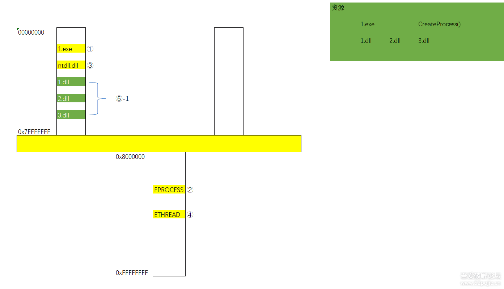
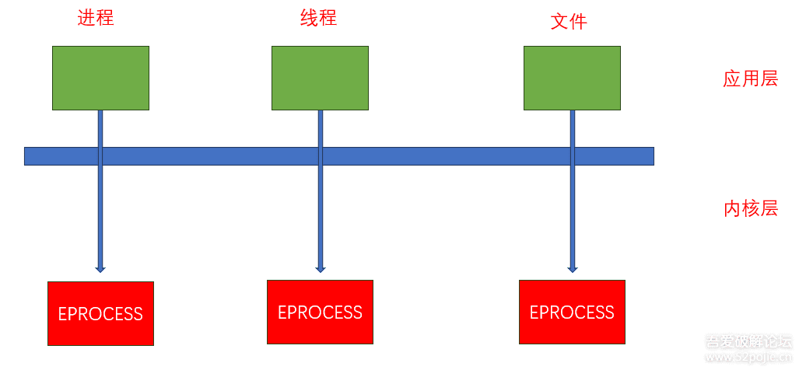
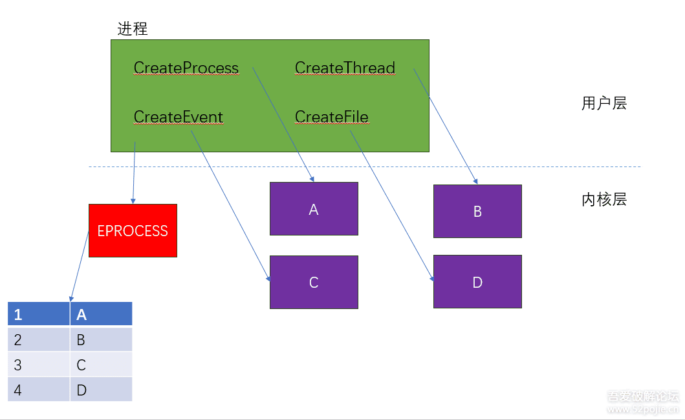

# Windows API、进程与线程基础
API（Application Programming Interface）应用程序接口，windows操作系统为我们提供已经实现好了的函数

几个重要DLL：
```
kernel32.dll：最核心的功能模块，比如管理内存、进程和线程相关的函数等
user32.dll：是Windows用户界面相关应用程序接口，如创建窗口和发送消息等
GDI32.dll：全称是Graphical Device Interface（图形设备接口），包含用于画图和显示文本的函数
```
## 进程
```text
进程
├─ 虚拟地址空间
│  ├─ 代码段
│  ├─ 数据段
│  ├─ 堆
│  ├─ 栈（每线程各自一份）
│  ├─ DLL映射
│  └─ 内存映射文件
├─ 线程集合
│  ├─ 主线程
│  ├─ 工作线程
│  └─ 后台线程
├─ 句柄表
│  ├─ 文件句柄
│  ├─ 进程句柄
│  ├─ 线程句柄
│  ├─ 事件/互斥体/信号量
│  └─ 其他对象
├─ 安全上下文
│  ├─ Token
│  ├─ SID
│  ├─ 权限
│  └─ 完整性级别
├─ 进程基础信息
│  ├─ PID
│  ├─ 父进程ID
│  ├─ 命令行
│  ├─ 当前目录
│  └─ 环境变量
└─ 已加载模块
   ├─ exe主模块
   ├─ kernel32.dll
   ├─ user32.dll
   └─ 其他DLL
```

进程的创建过程

1. 映射exe文件
2. 创建内核对象EPROCESS
3. 映射系统DLL（ntdll.dll）
4. 创建线程内核对象ETHREAD
5. 系统启动线程
     + 映射DLL（ntdll.LdrlnitializeThunk）
     + 线程开始执行

```c
//环境：win10 VS2022 
#define _CRT_SECURE_NO_WARNINGS 1
#include <stdio.h>
#include <windows.h>

//启动参数的相关信息，后面的拓展会提到
void GetStartInfo()
{
    STARTUPINFO si;
    GetStartupInfo(&si);
    printf("%X %X %X %X %X %X %X %X\n", si.dwX, si.dwY, si.dwXCountChars, si.dwYCountChars, si.dwFillAttribute, si.dwXSize, si.dwYSize, si.dwFlags);
}

//创建一个子进程
BOOL CreateChildProcess(PTCHAR ChildProcessName, PTCHAR CommandLine)
{
    STARTUPINFO si;
    PROCESS_INFORMATION pi;

    ZeroMemory(&si, sizeof(si));        //置0
    ZeroMemory(&pi, sizeof(pi));        //置0
    si.cb = sizeof(si);                 //这个成员是要初始化的

    //创建子进程 返回是否成功
    if (!CreateProcess(
        ChildProcessName,   //对象名称的完整路径
        CommandLine,        //命令行参数
        NULL,               //不继承进程句柄
        NULL,               //不继承线程句柄
        FALSE,              //不继承句柄
        0,                  //没有创建标志
        NULL,               //使用父进程环境变量
        NULL,               //使用父进程目录作为当前目录，可以自己设置目录
        &si,                //STARTUPINFO结构体
        &pi)                //PROCESS_INFORMATION结构体
        )
    {
        printf("创建进程错误 代码：%d\n", GetLastError());
        return FALSE;
    }
    printf("进程句柄：%X\t进程ID：%X\n线程句柄：%X\t线程ID：%X\n", pi.hProcess,pi.dwProcessId, pi.hThread,pi.dwThreadId);

    //释放句柄
    CloseHandle(pi.hProcess);
    CloseHandle(pi.hThread);
    return TRUE;
}

int main(int argc,char* argv[])
{
    //C:\\Program Files\\Internet Explorer\\iexplore.exe
    //C:\\Program Files (x86)\\Microsoft\\Edge\\Application\\msedge.exe
    TCHAR ApplicationName[] = TEXT("C:\\Program Files\\Internet Explorer\\iexplore.exe");
    TCHAR CmdLine[] = TEXT(" https://www.baidu.com");   //注意前面要加个空格
    CreateChildProcess(ApplicationName, CmdLine);       //调用函数
    //GetStartInfo();

    getchar();          //终端输入，类似于断点的作用
    return 0;
}
```
进程是应用程序的实例。进程包括一个虚拟地址空间及代码、数据、对象等程序运行所需环境和资源的集合。在内存空间中包括若干可执行的代码、数据、资源、一系列对系统对象操作的句柄，安全上下文、进程标识符(PID)，环境变量等程序执行的环境。同时，进程还包括一个或多个执行线程。

> 进程 = 一个正在运行的程序实例 + 它独占/持有的一整套运行环境。
+ 每个进程看到的内存地址，不是直接对应物理内存，而是操作系统给它的一套虚拟地址视图,是系统通过页表映射到物理内存或磁盘页文件。
    + 进程隔离:防止进程 A 直接访问进程 B 的内存
    + 程序可以假设自己有一整块连续空间
    + 内存管理更灵活：系统可以按页分配、按需映射、共享 DLL、换页、做权限控制（R/W/X）
+ 进程包含代码、数据、资源、对系统对象操作的句柄、安全上下文、进程标识符（PID）、环境变量、一个或多个执行线程
## 线程
线程是程序的执行流程。在操作系统层面，线程是需要操作系统为其分配执行时间片的基本单元。线程附属于进程，一个线程可以执行进程中任意部分的代码。一个系统中同一时间只能有少量线程执行（决定于CPU个数和核数），操作系统决定当前执行哪一个线程，并进行调度。每一个线程都包括一个上下文（主要是CPU寄存器值）。在进行线程调度时，系统会保存线程上下文。

进程本身不是执行单位，线程才是执行单位。

也就是说：
+ 进程提供资源容器
+ 线程真正执行代码一个进程可以有多个线程

比如：

+ 主线程负责 UI
+ 工作线程负责网络
+ 后台线程负责日志
+ 定时线程负责心跳

它们：

+ 共享同一个进程地址空间
+ 共享大多数资源
+ 但各自有自己的：
+ 寄存器上下文
+ 栈
+ TLS
+ 调度状态
  
**线程是 CPU 执行指令的一条独立控制流。**

线程本质上表示：

+ 当前执行到哪条指令了（RIP/EIP）
+ 当前函数栈在哪里（RSP/ESP）
+ 当前寄存器是什么值
+ 当前执行状态如何

也就是说，线程不是“代码本身”，而是“代码正在如何被执行”的状态集合。

**线程附属于进程，一个线程可以执行进程中任意部分的代码**

进程更像资源容器，线程更像执行单元。

（某些程序通过 APC、回调、VEH/SEH 把控制流引到你意想不到的位置）

### 线程调度（Scheduling）
操作系统内核维护很多线程，每个线程有不同状态。调度器会从“可运行线程”里选一个，让它占用某个 CPU 核心。

常见线程状态可以分为：
```
Running：正在运行
Ready：就绪，等 CPU
Waiting / Blocked：等待某事件，比如 IO、锁、信号量
Suspended：被挂起
Terminated：结束
```
**线程上下文（Thread Context）**

为了让线程从中断处无缝继续执行，系统必须保存的状态

**上下文切换（Context Switch）**

大致步骤可以理解成：

1. 当前线程 A 正在 CPU 上运行
2. 调度器决定切换到线程 B
3. 内核保存线程 A 的寄存器、栈相关状态
4. 加载线程 B 上次保存的状态
5. CPU 从线程 B 的指令位置继续执行
### 线程和栈
线程共享进程的大多数资源，但线程要独立执行代码，所以它必须有自己独立的调用现场，而栈就是调用现场的核心存储区。

+ 进程负责提供共享资源
    比如：
    ```
    地址空间
    代码段
    堆
    DLL
    句柄表
    全局变量
    ```
+ 线程负责执行指令

    CPU 实际调度的不是“进程整体”，而是线程。

    线程运行函数时，必须记录：
    ```
    当前执行到哪
    调用了哪些函数
    返回地址是什么
    局部变量存哪
    参数怎么传
    保存了哪些寄存器
    ```
    这些信息大部分都依赖栈来保存。


## 句柄
进程内部用来引用某个系统对象的“票据”或“索引”。系统不希望用户程序直接操作内核对象的真实地址。这样更安全，也更方便做权限检查和资源回收。

可以初略理解为：
```text
进程
 └─ 句柄表
     ├─ 0x40 -> 文件对象A
     ├─ 0x44 -> 事件对象B
     ├─ 0x48 -> 进程对象C
```
+ 句柄通常只在当前进程上下文里有意义
+ 同样数值的 HANDLE，在不同进程里可能指向不同对象
+ 句柄可以继承、复制、关闭
## 句柄表&内核对象

像进程、线程、文件、互斥体、事件等在内核都有一个对应的结构体，这些结构体由内核负责管理。我们管这样的对象叫做内核对象

内核对象 = 由操作系统内核创建和管理、用于表示某种系统资源或同步实体的数据结构。

比如：
```
进程
线程
文件
事件
互斥体
信号量
定时器
作业对象
访问令牌
文件映射对象
I/O 完成端口
```
这些都不是“用户自己定义的 C 结构体”，而是Windows 内核内部维护的一类对象。

在 Windows 内核语境下，对象更接近：一块由内核分配和维护的内存结构，它表示一种系统实体，并附带元数据和状态。

用户态通过句柄访问对象，内核态通过真实结构体管理对象。

内核对象是内核里的真实资源/结构体。句柄是进程用来引用该对象的用户态入口。

一个进程就有一张句柄表

这张表就是存的结构体的地址，那应用层怎么用呢，就用编号，比如说，当应用层想用A，就返回1，想用B就返回2。

句柄表就是一种映射关系，用户层的索引就是内核层的地址

内核对象是内核里的真实对象。句柄是某个进程句柄表里的一个“入口编号/票据”。不同进程可以引用同一个内核对象，但各自拿的是自己句柄表里的句柄值。句柄值只在创建它的那个进程上下文里有意义。

每个进程有自己的句柄表，句柄值只在本进程里解释，同一个数值在不同进程里可能代表完全不同的对象，某个进程里的句柄值不能直接拿到另一个进程里用

Windows 中的进程、线程、文件、事件、互斥体等资源都可以以内核对象的形式存在。内核对象本身由内核统一管理，而用户态程序不能直接操作对象内部结构，只能通过句柄访问。句柄并不是对象本身，而是当前进程句柄表中的一个入口，因此句柄表是进程私有的，句柄值只在所属进程内有意义。不同进程可以分别持有指向同一内核对象的不同句柄，例如一个进程通过 Create 创建对象，另一个进程通过 Open 获取对同一对象的引用。对象内部通常通过引用计数等机制管理生命周期，CloseHandle 只是关闭当前进程中的一个句柄引用，只有当所有引用都释放后，对象才会真正销毁。
### 句柄继承&DuplicateHandle
DuplicateHandle：把“一个进程里的句柄”合法复制到另一个进程里，不是复制内核对象，而是给另一个进程新建一个“指向同一内核对象的句柄表项”。复制的是“访问入口”，使两个进程能操作同一个对象。

想让 B 进程也能访问 A 当前持有的某个对象，比如 A 创建了一个事件对象、文件映射对象、管道端、进程句柄，想让 B 也能用。这时候就需要一种跨进程共享方式。

DuplicateHandle 做的事：

  1. 找到 A 句柄表里的 hA
  2. 确认它指向对象 O
  3. 做权限检查
  4. 在 B 进程的句柄表里插入一个新表项
  5. 让这个新表项也指向 O
  6. 返回一个只在 B 进程里有效的新句柄 hB
   
继承和 Duplicate本质上都是：不共享句柄值本身，而是让目标进程拥有一个新的句柄表项，指向同一个内核对象

但句柄继承发生在创建子进程时，DuplicateHandle发生在进程已经存在之后
### 权限掩码
掩码本质上就是一组位标志。

比如一个整数里，不同 bit 代表不同权限：

所以一个句柄不是简单“有或没有”，而是：有多大能力范围。
## 进程标识符（PID）
PID 是系统给每个进程分配的一个标识号。

PID 用来区分不同进程,可以被复用

通常流程是：

1. 先枚举到 PID
2. 再 OpenProcess(pid) 拿句柄
3. 再用句柄做读写、查询、终止等操作
### PID和HANDLE
PID 只是“进程编号”，而 HANDLE 才是“你被系统授权后拿到的、可实际操作该进程对象的引用”。

PID（Process ID）本质上只是一个整数编号，比如：
```text
notepad.exe -> PID 4028
```
它的作用主要是：标识进程、区分不同进程、方便枚举和定位目标

但 PID 本身不等于进程对象，也不等于进程句柄。

当调用`HANDLE h = OpenProcess(PROCESS_VM_READ | PROCESS_QUERY_INFORMATION, FALSE, pid);`

> “你告诉我目标 PID 是谁，我检查你是否有权限，然后给你一个句柄 h，这个句柄绑定了你对该进程对象的一组访问权。”

**API 不直接用 PID**

如果只凭 PID 就能随便调用：
```
ReadProcessMemory(pid, ...)
TerminateProcess(pid)
WriteProcessMemory(pid, ...)
```
那会有两个问题：

1) 权限控制很难统一

    系统必须反复检查你对该 PID 是否有这个权限。

2) 对象模型不统一

    Windows 的很多对象都走“句柄模型”：

   + 文件对象 → 文件句柄
   + 进程对象 → 进程句柄
   + 线程对象 → 线程句柄
   + 事件对象 → 事件句柄

这样 API 风格统一，也方便做引用计数和资源管理。

**HANDLE**

HANDLE 里隐含了很多重要信息：
```
它指向哪个对象
你对它有哪些访问权限
它属于哪个进程的句柄表
它是否可继承
它是否仍然有效
```
所以：

+ PID 像“身份证号”
+ HANDLE 像“带权限的门禁卡”

知道一个人的身份证号，不等于你就能进他家。但拿到了门禁卡，你才真的能开门。

**流程**
1. 通过 PID 找到目标
2. 用 OpenProcess 拿 HANDLE
3. 用 HANDLE 做操作

## DLL 注入


## 模块
一个程序由多个模块组成。程序没有运行时，模块以可执行文件的形式存在（exe、dll等）；程序运行后，所需要的模块都加载到进程的虚拟地址空间中，进行初始化的设置后，各模块就可以协同工作。每一个模块都可能包括代码、数据、资源等。

也就是被装载到进程地址空间中的一个可执行映像单元。
### exe
exe 只是磁盘上的程序文件模板，而进程是操作系统基于这个模板创建出来的运行时实例。

也就是说，同一个 .exe 文件，可以被系统重复“实例化”很多次；每实例化一次，系统就给它创建一套新的运行环境，于是就变成一个新的进程。

程序文件只是磁盘上的一份二进制文件，静态摆在那里。

当你双击它时，Windows 会做一整套事情：

+ 创建一个新的进程对象
+ 创建新的虚拟地址空间
+ 把 exe 映射到这个地址空间
+ 映射需要的 DLL
+ 建立主线程
+ 初始化栈、堆、PEB、环境变量、命令行
+ 让主线程从入口点开始执行

这一整套运行中的实体，才叫进程。

每次启动 exe，Windows 都不是“把同一个进程再打开一次”，而是再创建一个新的进程实例。

**效用**
1）隔离
2）独立状态
3）调度和权限管理

## 资源
程序运行依赖的各种系统资源

Windows 为了统一管理，大量资源都抽象成内核对象 + 句柄。

所以进程往往持有很多资源，但不会直接拿到“对象本体”，而是拿到一个 HANDLE 去引用它。

## 安全上下文
进程带着一个安全身份在运行

Windows 里这通常体现为：

+ 访问令牌（Access Token）
+ 用户 SID
+ 所属组
+ 权限（Privileges）
+ 完整性级别
+ UAC 相关状态

进程能否  
+ 打开别的进程
+ 读系统目录
+ 注入高权限进程
+ 调试别的进程
+ 修改服务
+ 访问注册表某些位置

都和它的安全上下文有关
## 环境变量
每个进程在启动时都有一份环境变量块。

因为程序运行时经常依赖这些值决定行为：

+ 找 DLL
+ 找配置目录
+ 切换模式
+ 判断当前环境


