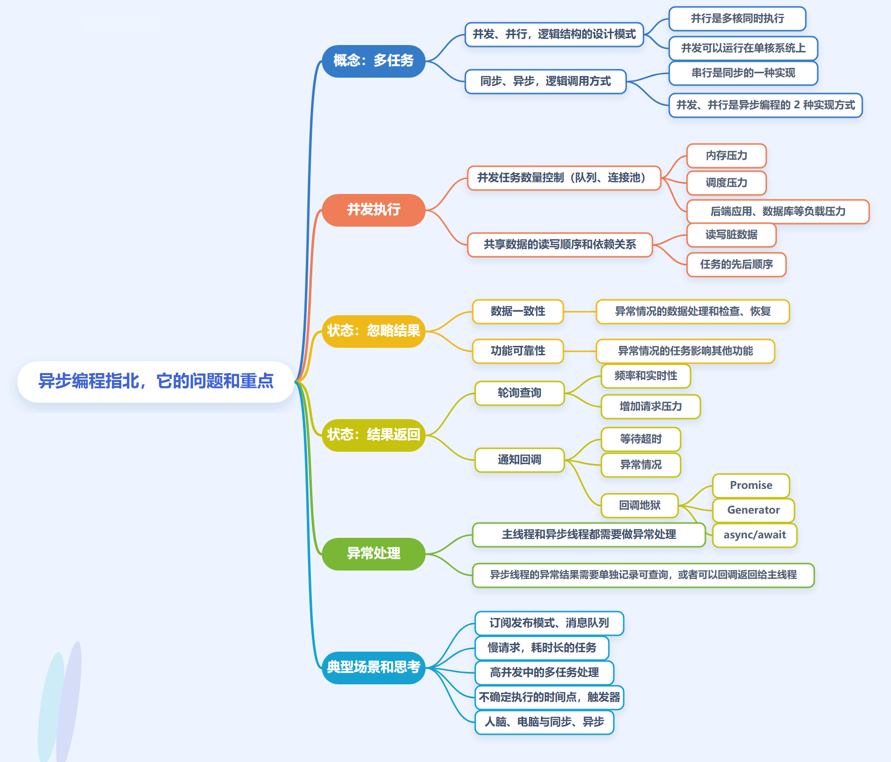

# 异步

+ 并发：多个任务在同一个时间段内同时执行，如果是单核心计算机，CPU 会不断地切换任务来完成并发操作。

+ 并行：多任务在同一个时刻同时执行，计算机需要有多核心，每个核心独立执行一个任务，多个任务同时执行，不需要切换。

+ 同步：多任务开始执行，任务 A、B、C 全部执行完成后才算是结束。

+ 异步：多任务开始执行，只需要主任务 A 执行完成就算结束，主任务执行的时候，可以同时执行异步任务 B、C，主任务 A 可以不需要等待异步任务 B、C 的结果。

并发、并行，是逻辑结构的设计模式；同步、异步，是逻辑调用方式。

串行是同步的一种实现，就是没有并发，所有任务一个一个执行完成；并发、并行是异步的 2 种实现方式。

程序里的异步就是控制流的转移不是由当前代码里一个清清楚楚的 call/jmp 直接决定，而是由外部事件、系统机制、运行时状态触发。
# 信号
## 信号的机制 
信号与硬件中断类似——异步模式。但信号是软件层面上实现的中断，早期常被称为“软中断”。每个进程收到的所有信号，都是由内核负责发送的。

正常是线性的：a -> b -> c

但如果中间来了一个 signal，真实流程可能变成：

a -> b执行到一半 -> 内核介入 -> handler -> 返回b剩余部分 / 或跳到别处

### 0 事件源
1. 硬件异常映射来的
+ 除零 → SIGFPE
+ 非法内存访问 → SIGSEGV
+ 非法指令 → SIGILL
+ trap / breakpoint → SIGTRAP

2. 内核状态变化
+ 子进程退出 → SIGCHLD
+ 管道写端写入时读端关闭 → SIGPIPE
+ 定时器到期 → SIGALRM

3. 用户或进程显式请求
+ kill
+ raise
+ sigqueue
+ 终端按 Ctrl+C
### 1 内核产生一个“待递送的信号”
也就是所谓的 pending signal（未决信号）。
### 2 内核检查这个信号当前能不能递送
1. 这个信号有没有被阻塞

进程/线程可以通过 signal mask 屏蔽一部分信号。

如果被屏蔽了，就先放在 pending 里，不立刻处理。

2. 目标线程/进程当前处于什么状态
+ 正在用户态执行
+ 正在内核态系统调用中
+ 刚准备从内核返回用户态

通常 signal 的“安排执行”会选在一个合适的边界。

3. 默认动作是什么
如果没有 handler，内核会根据该 signal 的默认行为决定：
+ 终止
+ 忽略
+ 停止
+ 继续
+ 终止并 core dump

### 3 可递送，内核准备“用户态信号栈帧”
假设这个信号被捕获，不是直接终止。

那内核要让用户态去执行 handler，可 handler 是用户代码，CPU 当前又不在那个函数里，怎么办？

答案是：

内核伪造/布置一个用户态执行现场。

大致会做这些事：
```
保存原本的寄存器上下文
保存程序计数器、栈状态、signal mask 等
在用户栈上布置一个 signal frame
把“返回地址”安排到一段信号返回 trampoline
把用户态即将恢复执行的位置改成 handler 地址
准备 handler 参数，比如 signal 编号，可能还有 siginfo_t 和 ucontext
```
于是当内核返回用户态时，进程“看起来像是”自己调用了 handler。

但其实不是你代码主动 call 的。
是 内核帮你搭了个舞台，然后把你推上去演。
### 4 handler 在用户态执行
### 5 handler 结束，通过特殊机制返回
handler 不是普通函数返回就结束了。

它最终要借助一个特殊的“signal return”过程，让内核恢复先前保存的上下文。

可以把它理解成：
```
handler 结束
调用一段 signal trampoline / restorer
触发 sigreturn 相关机制
内核把之前保存的寄存器、PC、mask 恢复
```
如果上下文没被改，那就接着原先的位置继续。

如果你改过上下文，那返回路径就可能完全变。

这就是为什么 signal 能被拿来搞：控制流劫持、反调试、虚假崩溃、非线性状态机
### 默认动作、阻塞、未决、捕获
1. 默认动作

    每种 signal 都有默认行为，比如：
    * 终止进程
    * 忽略
    * 停止进程
    * 从停止继续运行
    * 终止并生成 core

    默认动作就是：如果你不自己处理，内核按这个模板来。
---
2. 捕获

    捕获就是你注册 handler：

    ```c
    signal(SIGINT, handler);
    ```
    或者 `sigaction`。

    含义是：

    > 这个信号来时，不按默认动作直接终结，而是先进入我的处理函数。

---

3. 阻塞

    阻塞不是“信号消失”，而是：先别递送。

    信号来了，但暂时不处理，挂账。

---

4. 未决

    未决就是：已经产生，但还没递送。

    它可能因为被阻塞未决，也可能因为还没到合适时机未决。

    这几个概念串起来就是：

    > 信号先产生 → 进入 pending → 如果未阻塞且可处理，就递送 → 根据默认动作或 handler 执行
### 信号集
```
未决信号集中保存的是未被处理的信号
阻塞信号集是当前进程要阻塞的信号的集合
这两个集合存储在内核的PCB中
```
当进程收到一个SIGINT信号（信号编号为2），首先这个信号会保存在未决信号集合中，此时对应的2号编号的这个位置上置为1，表示处于未决状态；在这个信号需要被处理之前首先要在阻塞信号集中的编号为2的位置上去检查该值是否为1：

+ 如果为1，表示SIGNIT信号被当前进程阻塞了，这个信号暂时不被处理，所以未决信号集上该位置上的值保持为1，表示该信号处于未决状态；
+ 如果为0，表示SIGINT信号没有被当前进程阻塞，这个信号需要被处理，内核会对SIGINT信号进行处理（执行默认动作，忽略或者执行用户自定义的信号处理函数），并将未决信号集中编号为2的位置上将1变为0，表示该信号已经处理了，这个时间非常短暂，用户感知不到。

当SIGINT信号从阻塞信号集中解除阻塞之后，该信号就会被处理
### SIGCHLD信号（父进程利用此信号对子进程进行回收）
产生SIGCHLD信号:

+ 子进程结束的时候
+ 子进程收到SIGSTOP信号 kill -CONT
+ 当子进程停止时，收到SIGCONT kill -9

SIGCHLD信号信号的作用：

子进程退出后，内核会给它的父进程发送SIGCHLD信号，父进程收到这个信号后可以对子进程进行回收。
使用SIGCHLD信号完成对子进程的回收可以避免父进程阻塞等待而不能执行其他操作，只有当父进程收到SIGCHLD信号之后才去调用信号捕捉函数完成对子进程的回收，未收到SIGCHLD信号之前可以处理其他操作。